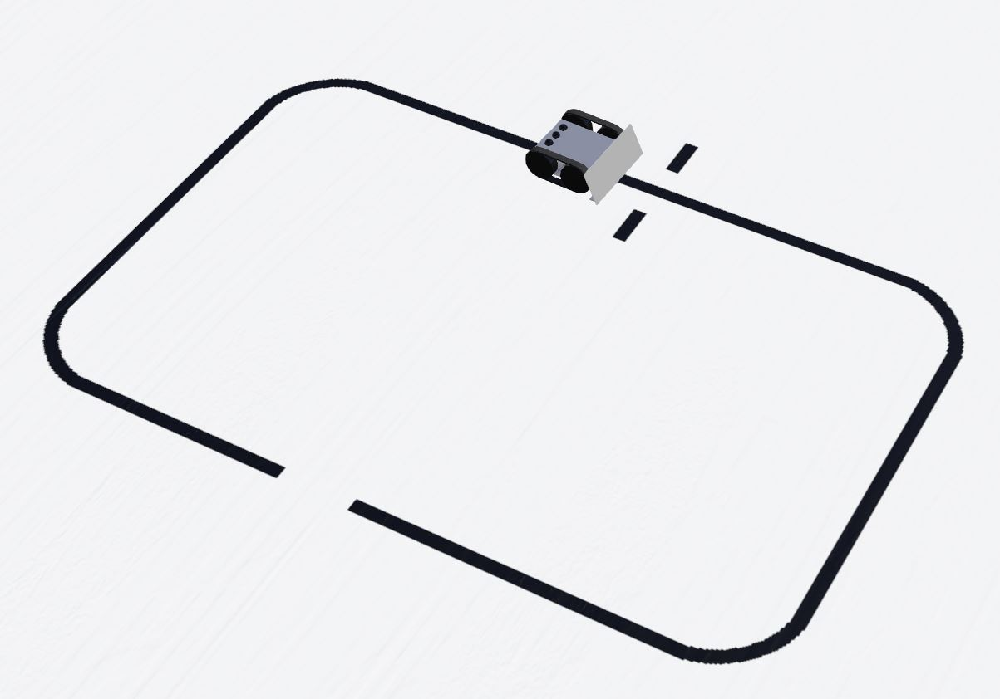

# Radon Alcer - Line Follower <!-- omit in toc -->

[](http://choosealicense.com/licenses/mit/)
[](https://www.repostatus.org/#wip)
[](https://github.com/BlueAndi/RadonAlcer/releases)
[](https://github.com/BlueAndi/RadonAlcer/actions?query=workflow%3A%22PlatformIO+CI%22)

A line follower robot as fast as the famous Radon Alcer pod racer driven by Anakin Skywalker. :-)

- [The robot](#the-robot)
- [The simulation](#the-simulation)
  - [Intallation](#intallation)
  - [The Webots library](#the-webots-library)
  - [Build](#build)
  - [Preparation](#preparation)
  - [Running the robot on track](#running-the-robot-on-track)
- [Used Libraries](#used-libraries)
- [Issues, Ideas And Bugs](#issues-ideas-and-bugs)
- [License](#license)
- [Contribution](#contribution)

# The robot
The main target of the firmware is the Pololu Zumo32U4 robot (see https://www.pololu.com/category/129/zumo-robots-and-accessories) from Pololu.


# The simulation
The simulation is based on the open source robot simulator *Webots*. The application and the services are equal to the target firmware. Only the HAL is different in the simulation.

* Website: https://cyberbotics.com/#cyberbotics
* Github: https://github.com/cyberbotics/webots

## Intallation

1. Install [Webots](https://cyberbotics.com).
2. Setup for [external controllers](https://www.cyberbotics.com/doc/guide/running-extern-robot-controllers):
    1. Set environment variable ```WEBOTS_HOME``` to installation directory of Webots.
    2. Add to path:
        * Linux: ```${WEBOTS_HOME}/lib/controller```
        * Windows: ```%WEBOTS_HOME%\lib\controller```
3. Install the native compiler toolchain:
    * Linux: Install the gcc toolchain, depended on your distribution.
    * Windows: Install the [MSYS2](https://www.msys2.org) toolchain and follow the instructions there.

## The Webots library
To adapt the HAL to the simulation, some sourcecode files from Webots are necessary. Currently there is no Webots library in the platformio registry available. Therefore a local library is created during the build. Ensure that that Webots is already installed, before you try to build it!

The library creation is handled in the ```./scripts/create_webots_library.py``` script and runs automatically after building for the WebotsSim environment.

## Build

Platformio project tasks --> WebotsSim --> Build

## Preparation

1. Start the Webots simulation.
2. File --> Open World
3. Select ```webots/LineFollower_track.wbt```.
4. The loaded world should now look like this: 
5. Open a command line (shell) and change to the folder with the built executable in ```.pio/build/native```. This folder contains all necessary shared libraries as well.
6. Start the executable and the simulated display should show the name of the team and etc.

## Running the robot on track

1. Click in simulation on the display to focus the simulation.
2. Now the keyboard keys a, b and c can be used to control the robot according to the implemented application logic.

# Used Libraries

| Library | Description | License |
| - | - | - |
| [Zumo32U4 library](https://github.com/pololu/zumo-32u4-arduino-library) | Provides access to the Zumo32U4 hardware. | MIT |

# Issues, Ideas And Bugs
If you have further ideas or you found some bugs, great! Create a [issue](https://github.com/BlueAndi/RadonAlcer/issues) or if you are able and willing to fix it by yourself, clone the repository and create a pull request.

# License
The whole source code is published under the [MIT license](http://choosealicense.com/licenses/mit/).
Consider the different licenses of the used third party libraries too!

# Contribution
Unless you explicitly state otherwise, any contribution intentionally submitted for inclusion in the work by you, shall be licensed as above, without any
additional terms or conditions.
